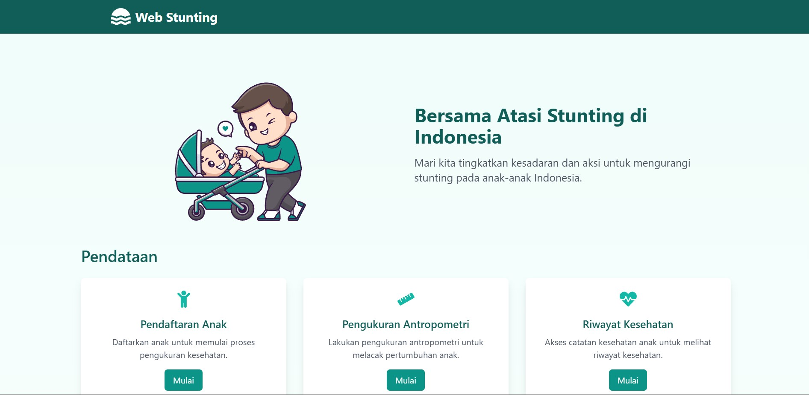
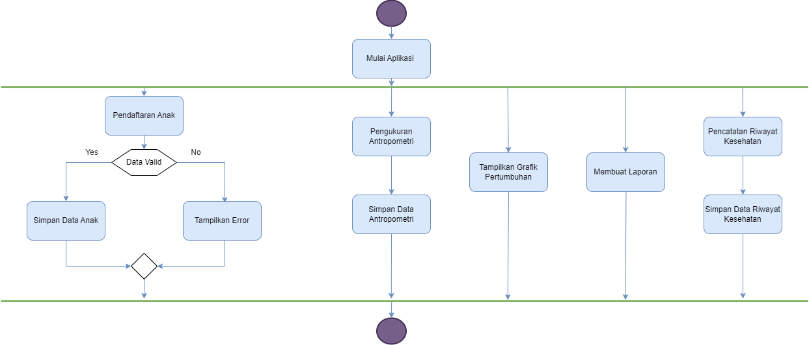
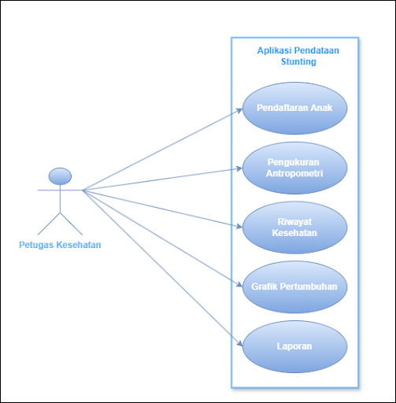
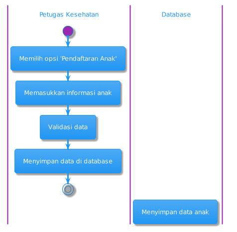
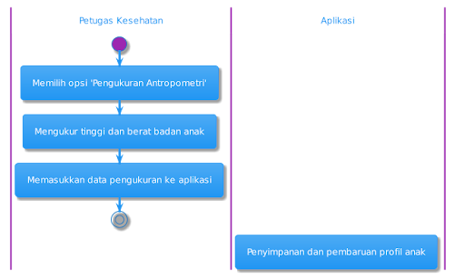
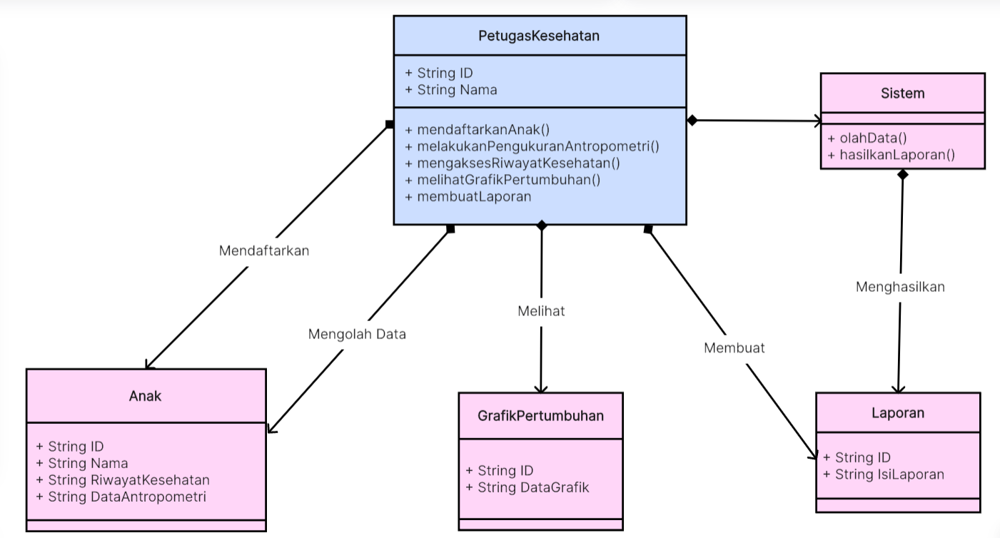
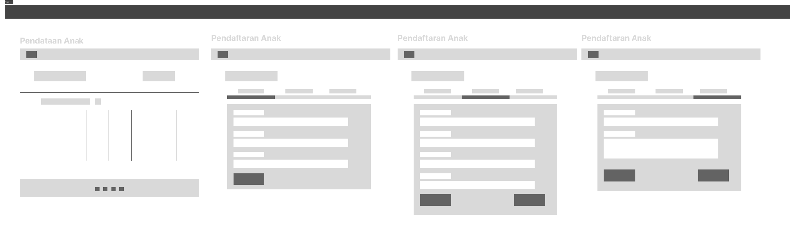
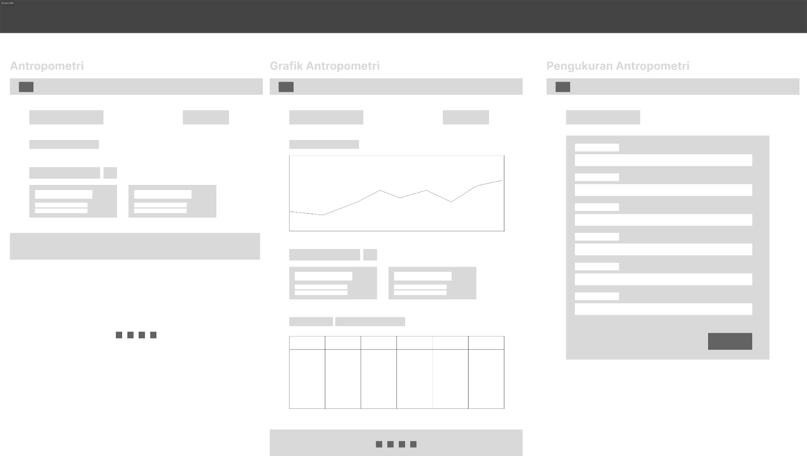
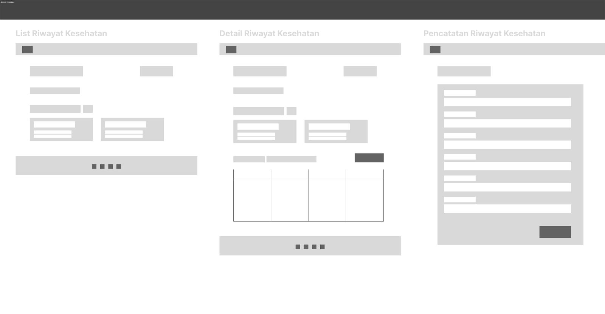
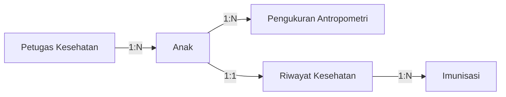

<div align="center">
  <h1>🌱 Aplikasi Monitoring Stunting</h1>
  <p>
    <a href="https://github.com/BelajarPyramidReact/web_stunting/stargazers">
      
    </a>
    <a href="https://github.com/BelajarPyramidReact/web_stunting/network">
      
    </a>
    <a href="https://github.com/BelajarPyramidReact/web_stunting/issues">
      
    </a>
  </p>
  <div align="center">
  
</div>
  <p>Solusi modern untuk monitoring dan pendataan kasus stunting berbasis web 🚀</p>
</div>


## ✨ Fitur Utama

<table>
  <tr>
    <td>
      <h3>📝 Pendataan Anak</h3>
      <ul>
        <li>Manajemen data anak komprehensif</li>
        <li>Form pendaftaran interaktif</li>
        <li>Pencarian & filter data</li>
      </ul>
    </td>
    <td>
      <h3>📊 Antropometri</h3>
      <ul>
        <li>Tracking pertumbuhan real-time</li>
        <li>Visualisasi grafik interaktif</li>
        <li>Export laporan PDF</li>
      </ul>
    </td>
  </tr>
  <tr>
    <td>
      <h3>🏥 Riwayat Kesehatan</h3>
      <ul>
        <li>Pencatatan imunisasi</li>
        <li>Tracking vaksinasi</li>
        <li>Histori kesehatan lengkap</li>
      </ul>
    </td>
    <td>
      <h3>📈 Analisis & Laporan</h3>
      <ul>
        <li>Dashboard analitik</li>
        <li>Laporan berkala</li>
        <li>Statistik pertumbuhan</li>
      </ul>
    </td>
  </tr>
</table>

## 💫 System Design

Dokumentasi desain sistem untuk Aplikasi Monitoring Stunting

### 🎯 Overview

<table>
  <tr>
    <td width="70%">
      
    </td>
    <td width="30%" valign="top">
      <h4>Komponen Utama</h4>
      <ul>
        <li>🧒 Pendaftaran Anak</li>
        <li>📏 Pengukuran Antropometri</li>
        <li>🩺 Riwayat Kesehatan</li>
        <li>📈 Grafik Pertumbuhan</li>
        <li>📝 Pelaporan</li>
      </ul>
    </td>
  </tr>
</table>

### 🔄 Use Cases

<table>
  <tr>
    <td width="60%">
      
    </td>
    <td width="40%" valign="top">
      <h4>Actor: Petugas Kesehatan</h4>
      <ul>
        <li>✍️ Pendaftaran Anak</li>
        <li>📏 Pengukuran Antropometri</li>
        <li>📋 Manajemen Riwayat Kesehatan</li>
        <li>📊 Analisis & Pelaporan</li>
      </ul>
    </td>
  </tr>
</table>

### 🔄 Activity Flows

  <details class="flow-card">
    <summary>📝 Pendaftaran Anak</summary>
    
  </details>
  <details class="flow-card">
    <summary>📏 Pengukuran Antropometri</summary>
    
  </details>
  <details class="flow-card">
    <summary>🏥 Riwayat Kesehatan</summary>
    
  </details>
  <details class="flow-card">
    <summary>📊 Analisis Data</summary>
    
  </details>

### 🔄 Sequence Flows

<details>
<summary>📝 Pendaftaran Anak</summary>

</details>

<details>
<summary>📏 Pengukuran Antropometri</summary>

</details>

<details>
<summary>🏥 Riwayat Kesehatan</summary>

</details>

<details>
<summary>📊 Grafik Pertumbuhan</summary>

</details>

### 📦 Data Model

<table>
  <tr>
    <td width="100%">
      <h4>Class Diagram Aplikasi Pendataan Stunting</h4>
      
    </td>
  </tr>
</table>

### 🎨 Desain UI/UX

<div class="grid grid-cols-2 gap-4">
  
  <div class="design-card">
    <h4>📝 Formulir Pendaftaran Anak</h4>
    
    <ul>
      <li>✨ Formulir multi-step</li>
      <li>🔄 Validasi data</li>
      <li>📸 Unggah foto</li>
    </ul>
  </div>
  
  <div class="design-card">
    <h4>📏 Antropometri</h4>
    
    <ul>
      <li>📈 Grafik interaktif</li>
      <li>🔄 Pembaruan secara real-time</li>
      <li>📊 Pelacakan kemajuan</li>
    </ul>
  </div>
  
  <div class="design-card">
    <h4>🏥 Riwayat Kesehatan</h4>
    
    <ul>
      <li>📅 Tampilan garis waktu</li>
      <li>🔍 Pencarian lanjutan</li>
      <li>📑 Manajemen dokumen</li>
    </ul>
  </div>
</div>

### 🔗 Data Relationships



## 🏗️ Arsitektur

Proyek ini menggunakan repository dengan dua submodule utama:

```
web_stunting/
├── web_stunting_be/     # Backend service (Python Pyramid)
└── web_stunting_fe/     # Frontend app (React)
```

### 🔧 Tech Stack

<table>
  <tr>
    <td>Frontend</td>
    <td>Backend</td>
    <td>Database</td>
  </tr>
  <tr>
    <td>
      
      
    </td>
    <td>
      
      
    </td>
    <td>
      
    </td>
  </tr>
</table>

## 🚀 Quick Start

### Clone Repository & Submodules

```bash
# Clone main repository
git clone https://github.com/BelajarPyramidReact/web_stunting.git

# Initialize and update submodules
cd web_stunting
git submodule init
git submodule update
```

### Backend Setup

```bash
cd web_stunting_be

# Create virtual environment
python -m venv env
source env/bin/activate  # Linux/Mac
env\Scripts\activate     # Windows

# Install dependencies
pip install -e .

# Configure database
alembic upgrade head

# Run development server
pserve development.ini
```

### Frontend Setup

```bash
cd web_stunting_fe

# Install dependencies
npm install

# Run development server
npm run dev
```

## 🌐 API Documentation

<details>
<summary>📚 Available Endpoints</summary>

Untuk melihat koleksi lengkap JSON Postman, kunjungi [tautan ini](https://drive.google.com/file/d/1vwPRItBOWfLd9sPXDddndqM4LwjHuov_/view?usp=sharing).

</details>

---

<div align="center">
  Thank You For Your Contributtions
</div>